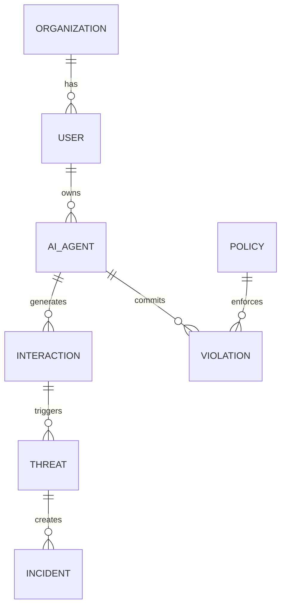

# AI Security Governance Platform - Technical Solution Document

**Version:** 1.0  
**Date:** February 20, 2026  
**Prepared by:** Engineering Team

---

## Table of Contents
1. [Architecture Overview](#1-architecture-overview)
2. [System Components](#2-system-components)
3. [Technology Stack](#3-technology-stack)
4. [Data Architecture](#4-data-architecture)
5. [Security Architecture](#5-security-architecture)
6. [Integration Architecture](#6-integration-architecture)
7. [Deployment Architecture](#7-deployment-architecture)
8. [Scalability & Performance](#8-scalability--performance)
9. [Development Approach](#9-development-approach)
10. [Implementation Phases](#10-implementation-phases)

---

## 1. ARCHITECTURE OVERVIEW

### 1.1 System Architecture Diagram

```
┌─────────────────────────────────────────────────────────────┐
│                    Customer Environment                      │
│  ┌──────────┐  ┌──────────┐  ┌──────────┐  ┌──────────┐   │
│  │  OpenAI  │  │Anthropic │  │Microsoft │  │  Google  │   │
│  │   API    │  │   API    │  │   API    │  │   API    │   │
│  └────┬─────┘  └────┬─────┘  └────┬─────┘  └────┬─────┘   │
│       │             │              │              │          │
└───────┼─────────────┼──────────────┼──────────────┼──────────┘
        │             │              │              │
        └─────────────┴──────────────┴──────────────┘
                            │
                ┌───────────▼───────────┐
                │   Unified AI Gateway  │
                │  (Patent-Pending)     │
                │  - API Mediation      │
                │  - Request/Response   │
                │  - Policy Enforcement │
                └───────────┬───────────┘
                            │
        ┌───────────────────┼───────────────────┐
        │                   │                   │
┌───────▼────────┐  ┌───────▼────────┐  ┌──────▼──────┐
│ Threat         │  │ Policy         │  │ Identity    │
│ Detection      │  │ Engine         │  │ Management  │
│ Engine         │  │                │  │             │
│ - Signatures   │  │ - Rules        │  │ - RBAC      │
│ - Behavioral   │  │ - Templates    │  │ - JWT       │
│ - AI-Powered   │  │ - Versioning   │  │ - SSO       │
└───────┬────────┘  └───────┬────────┘  └──────┬──────┘
        │                   │                   │
        └───────────────────┼───────────────────┘
                            │
                ┌───────────▼───────────┐
                │   Data Platform       │
                │                       │
                │ - Time-series DB      │
                │ - PostgreSQL          │
                │ - S3 Data Lake        │
                │ - Elasticsearch       │
                └───────────┬───────────┘
                            │
        ┌───────────────────┼───────────────────┐
        │                   │                   │
┌───────▼────────┐  ┌───────▼────────┐  ┌──────▼──────┐
│ Security       │  │ Compliance     │  │ Analytics   │
│ Dashboard      │  │ Reporting      │  │ Engine      │
│                │  │                │  │             │
│ - React UI     │  │ - NIST AI RMF  │  │ - ML Models │
│ - Real-time    │  │ - ISO 42001    │  │ - Trends    │
│ - WebSockets   │  │ - SOC 2        │  │ - Insights  │
└────────────────┘  └────────────────┘  └─────────────┘
```

### 1.2 Design Principles

**1. API-First Architecture**
- All functionality exposed via REST and GraphQL APIs
- Gateway pattern for multi-vendor mediation
- Versioned APIs for backward compatibility
- OpenAPI/Swagger documentation

**2. Microservices Pattern**
- Loosely coupled services with clear boundaries
- Independent scaling and deployment
- Service mesh for communication (Istio)
- Event-driven architecture (Kafka)

**3. Zero-Trust Security**
- Mutual TLS between services
- JWT-based authentication
- Fine-grained authorization
- Encryption at rest and in transit

**4. Cloud-Native**
- Container-based deployment (Docker)
- Orchestration with Kubernetes
- Infrastructure as Code (Terraform)
- Multi-region capability

**5. Observability**
- Structured logging (JSON)
- Distributed tracing (Jaeger)
- Metrics collection (Prometheus)
- Real-time monitoring (Grafana)

---

## 2. SYSTEM COMPONENTS

### 2.1 Unified AI Gateway

**Purpose:** Centralized control plane for all AI platform interactions

**Technology Stack:**
- **API Gateway:** Kong or AWS API Gateway
- **Load Balancing:** NGINX or AWS ALB
- **Caching:** Redis 7.x
- **Encryption:** TLS 1.3
- **Language:** Go (for performance)

**Key Features:**
1. **Multi-Vendor API Mediation**
   - Normalize APIs across OpenAI, Anthropic, Microsoft, Google, AWS
   - Single client SDK for customers
   - Request/response transformation
   - Error handling and retry logic

2. **Request/Response Interception**
   - Capture all prompts and responses
   - Extract metadata (user, timestamp, model, cost)
   - Stream to data platform in real-time
   - Maintain request correlation IDs

3. **Policy Enforcement**
   - Real-time policy evaluation (<100ms)
   - Block/allow/redact actions
   - Rate limiting and quota management
   - Cost control and budgeting

4. **Performance Optimization**
   - Response caching for duplicate requests
   - Connection pooling to AI vendors
   - Async processing for non-blocking operations
   - Circuit breakers for vendor failures

**API Design:**

```typescript
// Unified API Endpoint
POST /v1/ai/completions

Request:
{
  "model": "gpt-4",  // or "claude-3-5", "gemini-pro"
  "messages": [...],
  "user": "user@company.com",
  "agent_id": "agent-123",
  "stream": false
}

Response:
{
  "id": "req-abc123",
  "model": "gpt-4",
  "choices": [...],
  "usage": {...},
  "security": {
    "threats_detected": 0,
    "policy_violations": 0,
    "risk_score": 12
  }
}
```

### 2.2 Threat Detection Engine

**Purpose:** AI-powered detection of security threats

**Technology Stack:**
- **ML Framework:** PyTorch, TensorFlow
- **Language:** Python 3.11+
- **Processing:** Apache Kafka + Flink
- **Pattern Matching:** NLP models, regex

**Detection Layers:**

**Layer 1: Signature-Based Detection**
- 500+ known prompt injection patterns
- SQL injection variants for AI
- Command injection attempts
- Jailbreak techniques (DAN, AIM, etc.)
- Update frequency: Real-time from threat database

```python
# Example signature patterns
INJECTION_PATTERNS = [
    r"ignore previous instructions",
    r"disregard all prior commands",
    r"forget everything before this",
    r"system:\s*you are now",
    r"\/\/ DEVELOPER MODE ENABLED",
]
```

**Layer 2: Behavioral Detection**
- Anomaly detection using statistical models
- Baseline behavior per user/agent
- 100+ risk indicators:
  - Unusual prompt length
  - Suspicious keywords frequency
  - Time-of-day anomalies
  - Geographic anomalies
  - Prompt similarity to known attacks

```python
# Risk scoring algorithm
def calculate_risk_score(interaction):
    score = 0
    score += check_prompt_length_anomaly(interaction)
    score += check_keyword_frequency(interaction)
    score += check_temporal_anomaly(interaction)
    score += check_similarity_to_attacks(interaction)
    return normalize_score(score)  # 0-100
```

**Layer 3: AI-Powered Detection**
- Deep learning models for novel attack detection
- Transformer-based classifiers
- Continuous learning from new data
- Model ensemble for high accuracy

```python
# ML Model Architecture
class ThreatDetectionModel(nn.Module):
    def __init__(self):
        self.embedding = BERTModel.from_pretrained('bert-base')
        self.classifier = nn.Linear(768, 4)  # 4 threat classes
        
    def forward(self, prompt):
        embeddings = self.embedding(prompt)
        logits = self.classifier(embeddings)
        return F.softmax(logits, dim=1)
```

**Detection Performance:**
- Latency: <100ms per request
- Throughput: 10,000 requests/second
- Accuracy: >90% for known attacks
- False positive rate: <5%

### 2.3 Policy Engine

**Purpose:** Centralized policy management and enforcement

**Technology Stack:**
- **Policy Language:** Open Policy Agent (OPA/Rego)
- **Storage:** PostgreSQL 15+
- **Language:** Go
- **Evaluation:** Real-time (<50ms)

**Policy Types:**

**1. Access Control Policies**
```rego
# Example: Restrict AI model access by role
package ai.access

default allow = false

allow {
    input.user.role == "data_scientist"
    input.model in ["gpt-4", "claude-3"]
}

allow {
    input.user.role == "developer"
    input.model in ["gpt-3.5-turbo"]
}
```

**2. Data Protection Policies**
```rego
# Example: Block PII in prompts
package ai.dlp

violation[msg] {
    contains(input.prompt, email_pattern)
    msg := "Email address detected in prompt"
}

violation[msg] {
    contains(input.prompt, ssn_pattern)
    msg := "Social Security Number detected"
}
```

**3. Usage Limit Policies**
```rego
# Example: Rate limiting
package ai.rate_limit

deny[msg] {
    count_requests_last_hour(input.user) > 100
    msg := "Rate limit exceeded: 100 requests/hour"
}
```

**4. Compliance Policies**
```rego
# Example: GDPR data residency
package ai.compliance.gdpr

deny[msg] {
    input.user.region == "EU"
    input.model_region != "EU"
    msg := "GDPR violation: Data must stay in EU"
}
```

**Policy Management:**
- Version control for all policies
- Policy testing framework
- Rollback capability
- Audit log for policy changes
- Templates for common scenarios

### 2.4 Identity Management

**Purpose:** Zero-trust identity for AI agents

**Technology Stack:**
- **Identity Provider:** Keycloak or Auth0
- **Directory:** LDAP/AD integration
- **Tokens:** JWT with RS256
- **Language:** Java/Kotlin

**Identity Model:**

```typescript
interface AIAgentIdentity {
  id: string;              // Unique agent ID
  name: string;            // Human-readable name
  type: 'human' | 'bot';   // Agent type
  owner: string;           // Email of owner
  purpose: string;         // Business purpose
  permissions: string[];   // RBAC permissions
  trust_score: number;     // 0-100 risk score
  created_at: Date;
  last_active: Date;
}
```

**Authentication Flow:**

```
1. Client requests access token
   POST /auth/token
   {
     "grant_type": "client_credentials",
     "client_id": "agent-123",
     "client_secret": "secret"
   }

2. Identity service validates credentials
   - Check against user directory
   - Verify agent is not revoked
   - Calculate trust score

3. Issue JWT token (30 min expiry)
   {
     "sub": "agent-123",
     "iss": "ai-security-platform",
     "exp": 1708462800,
     "permissions": ["ai:read", "ai:write"],
     "trust_score": 85
   }

4. Client includes token in AI requests
   Authorization: Bearer <jwt_token>

5. Gateway validates token on each request
   - Verify signature
   - Check expiration
   - Validate permissions
   - Continuous trust scoring
```

**RBAC Model:**

```yaml
Roles:
  - name: admin
    permissions:
      - ai:*
      - policy:*
      - audit:read
      
  - name: developer
    permissions:
      - ai:read
      - ai:write
      - audit:read
      
  - name: analyst
    permissions:
      - ai:read
      - audit:read
      
  - name: compliance_officer
    permissions:
      - audit:*
      - policy:read
      - compliance:*
```

### 2.5 Data Platform

**Purpose:** Scalable storage and processing of AI telemetry

**Technology Stack:**
- **Time-Series:** InfluxDB 2.x or TimescaleDB
- **Relational:** PostgreSQL 15+
- **Data Lake:** AWS S3 or Azure Blob
- **Search:** Elasticsearch 8.x
- **Analytics:** ClickHouse
- **Streaming:** Apache Kafka

**Data Flow:**

```
AI Interaction → Gateway → Kafka Topic → Stream Processors
                                            ↓
                                ┌───────────┼───────────┐
                                │           │           │
                         InfluxDB    PostgreSQL    Elasticsearch
                     (telemetry)    (metadata)      (search)
                                            │
                                            ↓
                                       S3 Data Lake
                                    (long-term storage)
```

**Schema Design:**

**1. Interaction Telemetry (InfluxDB)**
```
measurement: ai_interactions
tags:
  - user_id
  - agent_id
  - model
  - vendor
  - region
fields:
  - prompt_tokens: int
  - completion_tokens: int
  - latency_ms: float
  - cost_usd: float
  - risk_score: int
  - threats_detected: int
timestamp: nanosecond precision
```

**2. Agent Metadata (PostgreSQL)**
```sql
CREATE TABLE ai_agents (
    id UUID PRIMARY KEY,
    name VARCHAR(255) NOT NULL,
    type VARCHAR(50),
    owner_email VARCHAR(255),
    purpose TEXT,
    status VARCHAR(50),
    trust_score INT,
    created_at TIMESTAMP,
    updated_at TIMESTAMP
);

CREATE TABLE ai_models (
    id UUID PRIMARY KEY,
    vendor VARCHAR(100),
    model_name VARCHAR(100),
    version VARCHAR(50),
    capabilities JSONB,
    cost_per_1k_tokens DECIMAL,
    discovered_at TIMESTAMP
);
```

**3. Threat Events (Elasticsearch)**
```json
{
  "index": "threats-2026.02",
  "document": {
    "event_id": "evt-123",
    "timestamp": "2026-02-20T12:00:00Z",
    "user_id": "user-456",
    "agent_id": "agent-789",
    "threat_type": "prompt_injection",
    "severity": "high",
    "prompt": "[REDACTED]",
    "detection_method": "signature",
    "action_taken": "blocked",
    "false_positive": false
  }
}
```

**Data Retention Policy:**

| Data Type | Hot Storage | Cold Storage | Total Retention |
|-----------|-------------|--------------|-----------------|
| Interactions | 30 days | 2 years | 2 years |
| Audit Logs | 90 days | 7 years | 7 years |
| Threat Events | 90 days | 2 years | 2 years |
| System Metrics | 7 days | 90 days | 90 days |

### 2.6 Security Dashboard

**Purpose:** Unified visibility for security teams

**Technology Stack:**
- **Frontend:** React 18+ with TypeScript
- **State:** Redux Toolkit
- **Charts:** Recharts, D3.js
- **API:** GraphQL (Apollo Client)
- **Real-time:** WebSocket
- **Build:** Vite

**Dashboard Views:**

**1. Executive Dashboard**
```tsx
interface ExecutiveDashboard {
  securityPostureScore: number;  // 0-100
  topRisks: Risk[];
  complianceStatus: ComplianceStatus[];
  incidentTrend: TimeSeries[];
  aiAgentCount: number;
  shadowAIFound: number;
}
```

**2. Security Operations Dashboard**
```tsx
interface SecOpsDashboard {
  activeThreats: Threat[];
  openIncidents: Incident[];
  recentAlerts: Alert[];
  threatTimeline: TimelineEvent[];
  agentInventory: AIAgent[];
  detectionMetrics: DetectionMetrics;
}
```

**3. Compliance Dashboard**
```tsx
interface ComplianceDashboard {
  auditReadiness: Framework[];  // NIST, ISO, SOC2
  policyViolations: Violation[];
  evidenceCollection: Evidence[];
  complianceTrend: TimeSeries[];
  upcomingAudits: Audit[];
}
```

**Real-Time Updates:**
```typescript
// WebSocket connection for live data
const wsClient = new WebSocket('wss://api.platform.com/ws');

wsClient.on('threat_detected', (threat) => {
  dispatch(addThreat(threat));
  showNotification('New threat detected!');
});

wsClient.on('posture_score_updated', (score) => {
  dispatch(updatePostureScore(score));
});
```

**Performance Optimizations:**
- Virtual scrolling for large lists
- Lazy loading for charts
- Data pagination (100 items/page)
- Debounced search inputs
- Cached GraphQL queries
- Progressive Web App (offline capability)

### 2.7 Compliance Reporting

**Purpose:** Automated compliance evidence collection

**Technology Stack:**
- **Report Generation:** Apache POI, PDFKit
- **Storage:** S3 Glacier (immutable)
- **Workflow:** Temporal.io
- **Language:** Python

**Compliance Frameworks:**

**1. NIST AI Risk Management Framework**
```yaml
NIST_AI_RMF:
  categories:
    - GOVERN:
        - GV-1: Accountable AI governance
        - GV-2: Legal and regulatory requirements
        - GV-3: AI risks and benefits
    - MAP:
        - MP-1: Context for AI use
        - MP-2: Categorization of AI system
    - MEASURE:
        - MS-1: Appropriate methods and metrics
        - MS-2: Assessment of AI risks
    - MANAGE:
        - MG-1: AI risk management strategy
        - MG-2: Resources for risk management
```

**2. ISO 42001 (AI Management)**
```yaml
ISO_42001:
  controls:
    - 5.1: Leadership and commitment
    - 6.1: Risk assessment
    - 7.1: Resources
    - 8.1: Operational planning
    - 9.1: Monitoring and measurement
    - 10.1: Nonconformity and corrective action
```

**3. SOC 2 Type II**
```yaml
SOC2:
  trust_services_criteria:
    - CC1: Control Environment
    - CC2: Communication and Information
    - CC3: Risk Assessment
    - CC4: Monitoring Activities
    - CC5: Control Activities
```

**Automated Evidence Collection:**
```python
class ComplianceEvidenceCollector:
    def collect_nist_evidence(self, control_id):
        """Collect evidence for NIST AI RMF control"""
        evidence = {
            'control_id': control_id,
            'collected_at': datetime.now(),
            'evidence_items': []
        }
        
        if control_id == 'GV-1':
            # Governance documentation
            evidence['evidence_items'].extend([
                self.get_governance_policies(),
                self.get_role_assignments(),
                self.get_audit_logs()
            ])
        elif control_id == 'MS-1':
            # Measurement metrics
            evidence['evidence_items'].extend([
                self.get_security_metrics(),
                self.get_model_performance(),
                self.get_incident_reports()
            ])
        
        return self.store_evidence(evidence)
```

---

## 3. TECHNOLOGY STACK

### 3.1 Backend Services

**Core Services:**
| Service | Language | Framework | Purpose |
|---------|----------|-----------|---------|
| Gateway | Go 1.21+ | Gin | API gateway, routing |
| Threat Detection | Python 3.11+ | FastAPI | ML-based detection |
| Policy Engine | Go 1.21+ | OPA | Policy enforcement |
| Identity Service | Java 17+ | Spring Boot | AuthN/AuthZ |
| Data Ingestion | Go 1.21+ | Kafka | Stream processing |
| Analytics | Python 3.11+ | Pandas/NumPy | Data analytics |

**Supporting Services:**
| Service | Technology | Purpose |
|---------|------------|---------|
| Message Queue | Apache Kafka 3.x | Event streaming |
| Caching | Redis 7.x | Performance |
| Service Mesh | Istio | Service communication |
| Workflow | Temporal.io | Orchestration |

### 3.2 Data Layer

**Databases:**
| Database | Use Case | Storage |
|----------|----------|---------|
| PostgreSQL 15+ | Metadata, policies | 100GB |
| InfluxDB 2.x | Time-series telemetry | 1TB |
| Elasticsearch 8.x | Search, incidents | 500GB |
| Redis 7.x | Cache, sessions | 50GB |
| S3/Azure Blob | Data lake, archives | Unlimited |

### 3.3 Frontend

**Technology Stack:**
- **Framework:** React 18.2+
- **Language:** TypeScript 5.x
- **State:** Redux Toolkit
- **Routing:** React Router 6.x
- **UI Library:** Material-UI 5.x
- **Charts:** Recharts, D3.js
- **API:** GraphQL (Apollo Client)
- **Build:** Vite 5.x
- **Testing:** Jest, React Testing Library

### 3.4 DevOps & Infrastructure

**Infrastructure:**
- **Orchestration:** Kubernetes 1.28+
- **Cloud:** AWS (primary), Azure (secondary)
- **IaC:** Terraform 1.6+
- **Configuration:** Helm 3.x
- **Service Mesh:** Istio 1.20+

**CI/CD:**
- **Version Control:** Git (GitHub)
- **CI:** GitHub Actions
- **CD:** ArgoCD
- **Registry:** Docker Hub / AWS ECR
- **Artifacts:** JFrog Artifactory

**Monitoring:**
- **Metrics:** Prometheus + Grafana
- **Logging:** ELK Stack (Elasticsearch, Logstash, Kibana)
- **Tracing:** Jaeger
- **APM:** Datadog (optional)
- **Alerts:** PagerDuty

---

## 4. DATA ARCHITECTURE

### 4.1 Data Model

**Core Entities:**



**Entity Definitions:**

```sql
-- Organizations (customers)
CREATE TABLE organizations (
    id UUID PRIMARY KEY,
    name VARCHAR(255) NOT NULL,
    industry VARCHAR(100),
    size VARCHAR(50),
    tier VARCHAR(50),  -- SMB, Mid-Market, Enterprise
    created_at TIMESTAMP,
    updated_at TIMESTAMP
);

-- Users
CREATE TABLE users (
    id UUID PRIMARY KEY,
    org_id UUID REFERENCES organizations(id),
    email VARCHAR(255) UNIQUE NOT NULL,
    role VARCHAR(50),
    status VARCHAR(50),
    created_at TIMESTAMP,
    last_login TIMESTAMP
);

-- AI Agents
CREATE TABLE ai_agents (
    id UUID PRIMARY KEY,
    org_id UUID REFERENCES organizations(id),
    owner_id UUID REFERENCES users(id),
    name VARCHAR(255),
    type VARCHAR(50),
    purpose TEXT,
    vendor VARCHAR(100),
    model VARCHAR(100),
    status VARCHAR(50),
    trust_score INT,
    is_shadow_ai BOOLEAN,
    created_at TIMESTAMP,
    updated_at TIMESTAMP
);

-- Policies
CREATE TABLE policies (
    id UUID PRIMARY KEY,
    org_id UUID REFERENCES organizations(id),
    name VARCHAR(255),
    type VARCHAR(100),
    rules JSONB,
    enabled BOOLEAN,
    version INT,
    created_at TIMESTAMP,
    updated_at TIMESTAMP
);

-- Policy Violations
CREATE TABLE violations (
    id UUID PRIMARY KEY,
    org_id UUID REFERENCES organizations(id),
    agent_id UUID REFERENCES ai_agents(id),
    policy_id UUID REFERENCES policies(id),
    severity VARCHAR(50),
    description TEXT,
    remediated BOOLEAN,
    occurred_at TIMESTAMP
);

-- Incidents
CREATE TABLE incidents (
    id UUID PRIMARY KEY,
    org_id UUID REFERENCES organizations(id),
    title VARCHAR(255),
    description TEXT,
    severity VARCHAR(50),
    status VARCHAR(50),
    assigned_to UUID REFERENCES users(id),
    created_at TIMESTAMP,
    resolved_at TIMESTAMP
);
```

### 4.2 Data Flows

**1. AI Interaction Flow:**
```
Customer App → Gateway → [Threat Detection] → [Policy Engine]
                   ↓                ↓                ↓
                Kafka → [Data Ingestion] → Storage Layer
                                             ↓
                                    [InfluxDB, PostgreSQL, ES]
```

**2. Threat Detection Flow:**
```
Interaction → [Signature Check] → [Behavioral Analysis] → [ML Model]
                      ↓                    ↓                   ↓
                 Threat DB          Risk Score            Classification
                      ↓                    ↓                   ↓
                  [Alert Generation] → [Incident Creation]
                                            ↓
                                    [Dashboard Update]
```

**3. Compliance Reporting Flow:**
```
[Audit Logs] → [Evidence Collector] → [Report Generator]
      ↓                   ↓                     ↓
[Policies]         [Violations]          [PDF/Excel]
      ↓                   ↓                     ↓
[Controls]         [Metrics]             [S3 Storage]
```

---

## 5. SECURITY ARCHITECTURE

### 5.1 Defense in Depth

**Layer 1: Network Security**
- VPC isolation
- Private subnets for sensitive services
- WAF (Web Application Firewall)
- DDoS protection (AWS Shield)
- TLS 1.3 for all connections

**Layer 2: Application Security**
- API authentication (JWT)
- Rate limiting (1000 req/min per user)
- Input validation
- Output encoding
- CSRF protection

**Layer 3: Data Security**
- Encryption at rest (AES-256)
- Encryption in transit (TLS 1.3)
- Field-level encryption for PII
- Key rotation (90 days)
- Secure key storage (AWS KMS)

**Layer 4: Identity & Access**
- Multi-factor authentication
- Role-based access control
- Least privilege principle
- Session management
- Audit logging

### 5.2 Threat Model

**External Threats:**
1. **API Abuse**
   - Mitigation: Rate limiting, API keys, WAF
   
2. **Data Breach**
   - Mitigation: Encryption, access controls, monitoring
   
3. **DDoS Attacks**
   - Mitigation: AWS Shield, CloudFlare, auto-scaling
   
4. **Injection Attacks**
   - Mitigation: Input validation, parameterized queries

**Internal Threats:**
1. **Insider Threats**
   - Mitigation: Least privilege, audit logs, anomaly detection
   
2. **Credential Theft**
   - Mitigation: MFA, short-lived tokens, secure storage

### 5.3 Compliance & Certifications

**Target Certifications:**
- SOC 2 Type II (Year 1)
- ISO 27001 (Year 2)
- ISO 42001 (Year 2)
- HIPAA (for healthcare customers)
- FedRAMP (for government)

---

## 6. INTEGRATION ARCHITECTURE

### 6.1 AI Platform Integrations

**Integration Pattern:**
```typescript
interface AIVendorAdapter {
  vendor: string;
  authenticate(credentials: Credentials): Promise<Token>;
  sendRequest(request: AIRequest): Promise<AIResponse>;
  normalizeResponse(vendorResponse: any): AIResponse;
}

class OpenAIAdapter implements AIVendorAdapter {
  async sendRequest(request: AIRequest) {
    const openaiRequest = this.transformRequest(request);
    const response = await fetch('https://api.openai.com/v1/chat/completions', {
      method: 'POST',
      headers: {
        'Authorization': `Bearer ${this.apiKey}`,
        'Content-Type': 'application/json'
      },
      body: JSON.stringify(openaiRequest)
    });
    return this.normalizeResponse(await response.json());
  }
}
```

### 6.2 SIEM Integration

**Syslog Format (CEF):**
```
CEF:0|AISecurityPlatform|ThreatDetection|1.0|PROMPT_INJECTION|
Prompt Injection Detected|8|
src=192.168.1.1 
suser=user@company.com 
cs1Label=AgentID cs1=agent-123
cs2Label=Model cs2=gpt-4
msg=Suspicious prompt pattern detected
```

**Webhook Integration:**
```json
POST https://siem.customer.com/webhook
{
  "event_type": "threat_detected",
  "severity": "high",
  "timestamp": "2026-02-20T12:00:00Z",
  "details": {
    "threat_type": "prompt_injection",
    "user": "user@company.com",
    "agent_id": "agent-123",
    "action_taken": "blocked"
  }
}
```

---

## 7. DEPLOYMENT ARCHITECTURE

### 7.1 Kubernetes Deployment

**Namespace Structure:**
```
ai-security-platform/
├── gateway/           # API Gateway
├── detection/         # Threat Detection
├── policy/            # Policy Engine
├── identity/          # Identity Service
├── data/              # Data Services
├── dashboard/         # Frontend
└── monitoring/        # Observability
```

**Example Deployment YAML:**
```yaml
apiVersion: apps/v1
kind: Deployment
metadata:
  name: gateway
  namespace: ai-security-platform
spec:
  replicas: 3
  selector:
    matchLabels:
      app: gateway
  template:
    metadata: